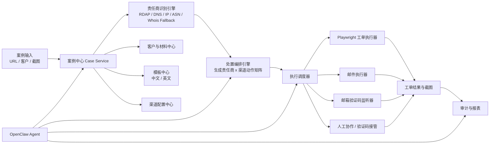

# 仿冒网站自动化处置 Bot 系统设计文档（OpenClaw 接入版）

## 文档状态
- 状态：Draft v1
- 日期：2026-03-20
- 目标读者：产品、开发、自动化工程师、AI Coding Agent、处置运营人员

## 1. 需求核对结论

### 1.1 核心业务目标
构建一套用于仿冒网站处置下架的自动化框架，接入 OpenClaw 后形成可执行的 Bot。Bot 的核心目标不是“查信息”，而是围绕单个仿冒站点，完成责任商识别、渠道匹配、工单/邮件并行提交、证据上传、验证码处理、处置留痕与状态追踪，最终推动站点下架。

### 1.2 已确认的业务约束
- 输入是客户上报的仿冒网站。
- 必须识别并覆盖 4 类责任商：
  - 域名注册商
  - DNS 解析商
  - IP 服务商 / 承载商
  - 顶级域名注册商 / Registry
- 同一个责任商可能有多个处置渠道，且要并行覆盖：
  - 工单
  - 邮件
- 某些服务商只有邮件，没有工单；该差异需要渠道配置来定义。
- 话术主体高度通用，但客户品牌不同，至少要支持客户品牌变量替换。
- 不同客户的营业执照、商标、身份证明、截图等材料不同，必须严格隔离，不能误用。
- 国内渠道统一中文，海外渠道统一英文，工单与邮件都要按区域语言强隔离。
- 现有部分自动化已通过网页脚本实现，但当前方式不利于统一编排、多渠道并发、配置管理和后续扩展。
- Whois 输出字段不稳定，不能依赖正则做核心识别。
- 某些工单存在验证码：
  - Google 类验证码 / 2FA
  - 邮箱验证码

### 1.3 我对需求的归纳
这不是单一的“网页自动化工具”，而是一个“仿冒网站处置编排系统”，其中网页自动化只是执行层之一。系统应拆成三层：
- 责任商识别层：识别网站由谁承载、由谁负责。
- 处置编排层：根据责任商和渠道配置，生成完整处置动作矩阵。
- 自动化执行层：执行工单提交、邮件发送、验证码处理、截图与附件上传。

## 2. 关键建议摘要

### 2.1 关于 Playwright 是否适合作为自动化技术
建议：`Playwright 作为默认的网页工单执行引擎`，但不要把系统设计成“脚本仓库”。

原因：
- 它适合复杂表单、文件上传、登录态复用、可视化调试、录制和回放。
- 它适合作为“浏览器执行器”，但不适合作为业务规则、客户配置、渠道知识的主存储介质。
- 未来部分渠道可能更适合：
  - HTTP API 直连
  - SMTP / API 发信
  - 人工介入
  - 第三方验证码平台

结论：
- `Playwright 用来执行`
- `配置文件用来描述`
- `OpenClaw 用来编排`
- `后台服务用来存储、隔离、审计`

### 2.2 关于配置应该放文件夹还是 Skill
建议：`渠道配置、客户配置、模板配置、附件规则放配置文件和后端数据库，不放 Skill 里`。

原因：
- Skill 适合定义“Bot 能做什么”和“如何调度工具”。
- 渠道配置是业务数据，会持续变更，应该版本化、可审计、可灰度，不应该写死在 Prompt/Skill。
- 客户材料和渠道规则属于高风险数据，必须有严格的 customer_id 隔离边界。

推荐分工：
- OpenClaw Skill：
  - 接收案例
  - 调用识别工具
  - 调用编排工具
  - 驱动渠道执行
  - 汇总结果
- 配置中心：
  - 客户配置
  - 渠道配置
  - 模板
  - 附件规则
  - 登录账户
  - 邮箱规则

### 2.3 关于 Whois 识别
建议：`采用 RDAP-first + DNS/IP/ASN 补充 + Whois 兼容回退`，不要再以正则解析原始 Whois 文本为主。

推荐顺序：
1. 优先使用 RDAP 获取结构化注册数据。
2. 通过 DNS 记录和 NS 特征识别 DNS 服务商。
3. 通过 A/AAAA 解析、ASN、IP WHOIS 识别 IP 服务商 / Hosting Provider。
4. 通过 Registry/RDAP 补充顶级域名注册机构。
5. 原始 Whois 仅作为兜底数据源，采用“键值映射 + 同义词词典 + 供应商知识库”解析，不以正则为主。

### 2.4 关于验证码
建议：`验证码能力不要直接绑定在 Playwright 上，而要做成独立策略层`。

原因：
- Playwright 能操作页面，但不提供真实生产验证码的内建破解能力。
- Google 类验证码通常需要：
  - 人工介入
  - 合规前提下的第三方打码平台
  - 或通过更稳定的登录态复用来规避重复校验
- 邮箱验证码更适合由“邮箱监听服务”处理，而不是让浏览器自动登录邮箱页面。

## 3. 系统范围

### 3.1 MVP 范围
- 接收单个或批量仿冒网站工单。
- 自动识别 4 类责任商。
- 生成每个责任商的处置动作矩阵。
- 根据渠道配置并行执行工单和邮件。
- 自动选择中文/英文模板。
- 根据渠道要求上传指定附件。
- 支持邮箱验证码自动读取。
- 支持验证码的人机协同挂起。
- 全流程留痕、截图、状态记录和失败重试。

### 3.2 暂不纳入 MVP
- 全自动破解所有验证码。
- 自动学习所有未知渠道页面并零配置生成脚本。
- 跨团队复杂审批流。
- 智能法务判断与法律意见生成。

## 4. 非功能需求

### 4.1 安全与隔离
- 客户材料必须按 `customer_id` 严格隔离。
- 渠道执行时，系统只能读取当前案例绑定客户的证据材料。
- 不允许跨客户引用话术、商标、营业执照或邮件签名。
- 全部关键操作保留审计日志。

### 4.2 稳定性
- 渠道页面 DOM 变动后，不应导致整个系统失效。
- 单渠道失败不影响其他渠道并行继续。
- 失败任务可重试。
- 有状态的浏览器执行需要支持恢复和人工接管。

### 4.3 可维护性
- 新增客户应以“录入配置 + 上传材料”为主，不改代码或少改代码。
- 新增渠道应以“新增渠道定义 + 新增适配器脚本”为主，不重构系统。
- 新增话术应以模板配置驱动。

## 5. 高层架构



## 6. 核心模块设计

### 6.1 案例中心 Case Service
职责：
- 接收案例输入。
- 管理案例状态。
- 绑定客户、站点、证据、处置结果。

核心输入：
- `customer_id`
- `target_url`
- `target_domain`
- `evidence_screenshot`
- `operator_notes`

核心状态：
- `NEW`
- `ENRICHING`
- `PLANNED`
- `RUNNING`
- `PARTIAL_SUCCESS`
- `SUCCESS`
- `FAILED`
- `WAITING_HUMAN`

### 6.2 责任商识别引擎
职责：
- 识别并归一化 4 类责任商。
- 输出责任商实体和可信度。

推荐识别链路：
1. 域名层
   - RDAP 查询 Registrar / Registry
2. DNS 层
   - NS / CNAME / SOA / DNS 特征识别 DNS Provider
3. IP 层
   - A / AAAA -> IP -> ASN / IP WHOIS -> Hosting / IP Service Provider
4. 回退层
   - 原始 Whois 文本解析器

输出示例：

```json
{
  "domain": "example-phish.com",
  "providers": [
    {
      "role": "registrar",
      "provider_key": "namecheap",
      "provider_name": "Namecheap, Inc.",
      "confidence": 0.96,
      "source": ["rdap"]
    },
    {
      "role": "dns",
      "provider_key": "cloudflare",
      "provider_name": "Cloudflare",
      "confidence": 0.92,
      "source": ["ns_fingerprint"]
    },
    {
      "role": "ip_hosting",
      "provider_key": "ovh",
      "provider_name": "OVH SAS",
      "confidence": 0.84,
      "source": ["a_record", "asn", "ip_whois"]
    }
  ]
}
```

### 6.3 处置编排引擎
职责：
- 根据责任商识别结果，查找该责任商的所有有效渠道。
- 按渠道区域自动决定中文或英文模板。
- 生成并行任务。

关键规则：
- 同一个责任商可同时存在 `ticket` 和 `email` 两种动作。
- 责任商的 4 个角色要分别处理，不能合并漏发。
- 单案例应生成完整的 `责任商 x 渠道` 矩阵。
- 渠道缺失时应显式标记为 `NO_ROUTE_DEFINED`。

### 6.4 渠道配置中心
职责：
- 维护服务商与处置渠道定义。
- 维护区域属性（CN / OVERSEAS）。
- 维护提交流程、字段映射、附件要求、登录方式、验证码策略。

示例结构：

```yaml
channel_id: namecheap-abuse-ticket
provider_key: namecheap
provider_role: registrar
region: OVERSEAS
language: en
route_type: browser_form
executor: playwright
entry_url: https://example.com/abuse
requires_login: true
auth_profile: namecheap_ops
captcha_strategy: human_or_solver
attachments:
  required:
    - phishing_screenshot
  optional:
    - trademark_certificate
    - business_license
form_schema:
  - field: reporter_name
    source: customer.contact_name
  - field: complaint_content
    source: template.body
```

### 6.5 客户与材料中心
职责：
- 存储客户品牌配置、客户话术变量、品牌材料和权限隔离。

推荐结构：

```text
/config/customers/{customer_id}/profile.yaml
/config/customers/{customer_id}/assets/business-license.pdf
/config/customers/{customer_id}/assets/trademark-1.pdf
/config/customers/{customer_id}/assets/logo.png
/config/customers/{customer_id}/templates/zh_CN/default.md
/config/customers/{customer_id}/templates/en/default.md
```

`profile.yaml` 示例：

```yaml
customer_id: tencent
brand_name_cn: 腾讯
brand_name_en: Tencent
legal_entity_cn: 深圳市腾讯计算机系统有限公司
legal_entity_en: Tencent Technology (Shenzhen) Company Limited
default_locale_cn: zh-CN
default_locale_overseas: en
contact_email: abuse@example.com
signature_cn: 我司是腾讯，受理仿冒钓鱼网站处置事项。
signature_en: We represent Tencent in phishing and impersonation takedown matters.
```

### 6.6 模板中心
职责：
- 管理中文 / 英文模板。
- 管理变量替换。
- 按渠道区域、客户、责任商类型、提交方式选择模板。

推荐变量：
- `{{brand_name}}`
- `{{legal_entity}}`
- `{{target_domain}}`
- `{{target_url}}`
- `{{provider_name}}`
- `{{violation_type}}`
- `{{evidence_summary}}`
- `{{contact_email}}`

说明：
- 虽然你当前最常替换的是品牌名，但系统不应只支持一个变量。
- 模板引擎至少要支持品牌名、法人主体、联系邮箱、案例摘要等变量，否则后期会反复改模板。

### 6.7 自动化执行层

#### Playwright 工单执行器
职责：
- 打开工单页面
- 登录账号
- 填写表单
- 上传附件
- 处理跳转、iframe、动态加载
- 截图
- 返回工单编号或提交结果

设计要求：
- 每个渠道脚本只做“页面动作”，不内嵌客户业务逻辑。
- 登录态使用独立 profile / storage state。
- 支持 headful 模式，便于人工接管验证码。

#### 邮件执行器
职责：
- 按渠道配置发送邮件。
- 自动选择标题、正文、附件。
- 记录 Message-ID 和发送结果。

推荐支持：
- SMTP
- Microsoft Graph / Gmail API（后续）

#### 邮箱验证码监听器
职责：
- 在渠道要求邮箱验证码时，自动获取最新验证码。
- 将验证码回填到正在执行的会话中。

推荐流程：
1. 识别当前渠道的邮箱验证码规则。
2. 监听指定邮箱收件箱。
3. 以主题、发件人、时间窗、正文字段规则提取 OTP。
4. 返回执行器继续提交。

不建议的方式：
- 用浏览器自动登录邮箱网页再读邮件。

建议的方式：
- 邮件协议/API 直连：
  - IMAP
  - Microsoft Graph
  - Gmail API

## 7. 关键技术决策

### 7.1 渠道扩展方式
采用 `配置驱动 + 适配器模式`。

意思是：
- 新服务商：新增 provider 配置
- 新渠道：新增 channel 配置
- 新页面交互：新增或更新适配器
- 新客户：新增 customer 配置和资产目录

而不是：
- 每来一个新渠道就复制一份脚本仓库
- 每来一个新客户就改 Prompt 或改代码中的常量

### 7.2 OpenClaw 的角色
OpenClaw 不应该直接保存客户材料和渠道规则，而应该作为：
- 任务入口
- 推理与编排层
- 操作代理
- 结果汇总器

推荐让 OpenClaw 调用以下内部工具：
- `create_case`
- `resolve_providers`
- `plan_actions`
- `run_channel_action`
- `poll_email_otp`
- `attach_customer_assets`
- `summarize_case_status`

### 7.3 验证码策略分层
验证码策略需要独立配置：
- `none`
- `manual_takeover`
- `third_party_solver`
- `email_otp`
- `totp`

说明：
- 如果所谓“Google 2FA”其实是 `reCAPTCHA / hCaptcha / Turnstile`，应归类为页面验证码。
- 如果所谓“Google 2FA”其实是 `Google Authenticator / TOTP`，应归类为一次性口令。
- 这两类处理方式完全不同，必须先区分。

## 8. 推荐目录结构

```text
/apps/api
/apps/worker
/apps/executors/playwright
/apps/executors/email
/apps/services/provider-resolution
/apps/services/mail-watcher
/config/providers/
/config/channels/
/config/customers/
/templates/messages/zh_CN/
/templates/messages/en/
/storage/evidence/
/storage/runs/
/docs/plans/
/docs/adr/
```

## 9. 数据模型建议

### 9.1 Customer
- `customer_id`
- `brand_name_cn`
- `brand_name_en`
- `legal_entity_cn`
- `legal_entity_en`
- `default_contact_email`
- `asset_root`

### 9.2 Case
- `case_id`
- `customer_id`
- `target_url`
- `target_domain`
- `status`
- `created_at`

### 9.3 ProviderResolution
- `case_id`
- `role`
- `provider_key`
- `provider_name`
- `confidence`
- `sources`

### 9.4 ChannelAction
- `action_id`
- `case_id`
- `provider_key`
- `provider_role`
- `channel_id`
- `route_type`
- `region`
- `language`
- `status`

### 9.5 SubmissionArtifact
- `artifact_id`
- `case_id`
- `customer_id`
- `artifact_type`
- `file_path`
- `hash`

### 9.6 ExecutionRun
- `run_id`
- `action_id`
- `executor`
- `started_at`
- `finished_at`
- `result`
- `external_ticket_id`
- `screenshot_path`
- `error_code`

## 10. 典型流程

### 10.1 单案例主流程
1. 录入案例：客户 + 仿冒 URL + 初始截图。
2. 自动解析域名与 IP。
3. 识别 4 类责任商。
4. 查询每个责任商的渠道配置。
5. 生成处置动作矩阵。
6. 为每个动作加载：
   - 对应语言模板
   - 对应客户材料
   - 对应渠道附件规则
7. 并行执行工单和邮件。
8. 如遇验证码：
   - 邮箱验证码：自动拉取
   - 其他验证码：挂起人工 / 第三方
9. 记录结果、编号、截图、失败原因。
10. 汇总案例完成状态。

### 10.2 多渠道并行原则
- 同一责任商的工单与邮件要并行。
- 不同责任商之间也要并行。
- 某一动作失败，不阻塞其他动作。
- 汇总状态按动作级别聚合。

## 11. Playwright 的定位建议

### 11.1 适合做的事情
- 表单填写
- 上传文件
- 登录态复用
- 复杂页面交互
- 截图和页面录制
- 人工接管

### 11.2 不适合单独承担的事情
- 责任商识别
- 客户材料隔离
- 渠道配置管理
- 验证码通用解题
- 邮箱验证码主流程

### 11.3 建议实施方式
- 每个浏览器渠道维护一个独立适配器。
- 使用稳定 selector 策略和页面断言。
- 保留 trace、截图和失败快照。
- 支持录制辅助生成初始脚本，但上线前要人工整理成标准适配器。

## 12. 验证码处理建议

### 12.1 邮箱验证码
建议优先实现，技术风险较低，收益高。

实现方式：
- 对接企业邮箱协议/API。
- 为每个渠道配置验证码提取规则：
  - 发件人
  - 主题关键字
  - 时间窗
  - 正则或模型提取 OTP

备注：
- 这里允许对邮件正文做 OTP 提取规则，因为验证码格式相对稳定。
- 不建议对 Whois 做类似思路作为主方案。

### 12.2 Google 类验证码 / 人机验证
建议按三层方案设计：

1. 第一层：规避
   - 使用稳定账号和持久登录态
   - 使用真实浏览器配置
   - 减少频繁重复触发

2. 第二层：人工接管
   - 自动化执行暂停
   - 打开当前页面供人工处理
   - 完成后继续

3. 第三层：第三方平台
   - 仅在合规允许时接入
   - 单独做策略开关
   - 按渠道启用

结论：
- `Playwright 可以配合验证码流程，但不能把“自动解验证码”当作 Playwright 自带能力`

## 13. AI/开发可直接执行的实现建议

### 13.1 第一阶段
- 建立项目骨架。
- 实现 Case / Customer / Channel / ProviderResolution 数据模型。
- 实现 RDAP-first 责任商识别引擎。
- 实现模板引擎。
- 实现客户资产隔离。

### 13.2 第二阶段
- 接入邮件执行器。
- 接入邮箱 OTP 监听器。
- 接入 3 到 5 个高频渠道的 Playwright 适配器。

### 13.3 第三阶段
- 接入 OpenClaw 工具层。
- 增加人工接管 UI / 任务挂起机制。
- 增加运行报表与失败分析。

## 14. 验收标准

- 给定一个案例，系统能输出完整的责任商识别结果。
- 给定责任商后，系统能生成完整渠道动作矩阵，不漏掉邮件或工单。
- 国内渠道全部输出中文，海外渠道全部输出英文。
- 同一案例中使用的所有客户材料都来自正确的 `customer_id`。
- 若渠道只要求截图，则不会误上传商标或营业执照。
- 若渠道要求商标和营业执照，则能自动补全上传。
- 邮箱验证码能在规定时间窗内自动获取并回填。
- 某一渠道失败不会中断其他渠道。
- 所有动作都有审计日志、截图和结果记录。

## 15. 当前必须确认的问题

以下问题会直接影响设计落地，建议你下一轮逐条确认：

1. 你说的“Google 2FA 认证”具体是哪一种？
   - reCAPTCHA
   - hCaptcha
   - Google Authenticator TOTP
   - Google 登录二次验证

2. 你们用于接收邮箱验证码的邮箱是什么类型？
   - 企业 Outlook / Exchange
   - Gmail
   - QQ 邮箱 / 163
   - 自建企业邮箱

3. 你们是否允许接入第三方打码平台？
   - 如果允许，需要明确法务/合规边界。

4. 你现在已经自动化过的渠道有哪些？
   - 建议给我一份渠道清单，我可以直接按优先级设计适配器结构。

5. 是否要求“默认全自动提交”，还是要“生成后人工确认再发”？

6. 目前案例是从哪里进入系统？
   - Excel / CSV
   - 邮件
   - 工单系统
   - 人工录入
   - API

7. 你们是否已经有统一的运营账号体系？
   - 每个渠道独立账号
   - 每个客户独立账号
   - 共用账号

8. 你们是否需要在处置完成后自动回写到现有工单系统或 CRM？

9. OpenClaw 你计划怎么接入？
   - 本地 Bot
   - 服务端 Agent
   - 现有系统里的 AI 模块

10. 初期优先支持多少个客户、多少个高频渠道？

## 16. 给 AI Coding Agent 的执行提示词

下面这段可以直接给 AI/开发继续实现：

```text
请实现一个“仿冒网站自动化处置编排系统”的 MVP，要求如下：

1. 核心对象：
- Customer
- Case
- ProviderResolution
- Channel
- ChannelAction
- SubmissionArtifact
- ExecutionRun

2. 核心能力：
- 输入 customer_id、target_url、target_domain、初始截图
- 基于 RDAP-first + DNS + IP/ASN + Whois Fallback 识别 4 类责任商：
  - registrar
  - dns
  - ip_hosting
  - registry
- 根据 provider_key + role 查询渠道配置
- 生成责任商 x 渠道动作矩阵
- 根据渠道 region 自动选择 zh-CN 或 en 模板
- 根据 customer_id 自动加载正确的品牌材料和附件
- 支持 email executor
- 支持 playwright executor
- 支持 email OTP watcher
- 记录所有执行结果、截图、工单编号和失败原因

3. 架构要求：
- 配置驱动
- 客户材料按 customer_id 强隔离
- 渠道适配器模式
- Playwright 只做浏览器执行，不承载业务配置
- 所有状态和结果可审计

4. 先实现目录结构：
- apps/api
- apps/worker
- apps/executors/playwright
- apps/executors/email
- apps/services/provider-resolution
- apps/services/mail-watcher
- config/providers
- config/channels
- config/customers
- templates/messages/zh_CN
- templates/messages/en

5. 输出：
- 初始项目结构
- 关键数据模型
- 配置样例
- 一个 provider-resolution MVP
- 一个 email executor MVP
- 一个 Playwright channel adapter 示例
```

## 17. 参考资料

- [ICANN RDAP](https://www.icann.org/rdap/)
- [RFC 9083: JSON Responses for RDAP](https://www.rfc-editor.org/rfc/rfc9083)
- [Playwright Authentication](https://playwright.dev/docs/auth)
- [Playwright Input / File Uploads](https://playwright.dev/docs/input)
- [OpenClaw Browser Login](https://docs.openclaw.ai/tools/browser-login)
- [OpenClaw Gmail PubSub](https://docs.openclaw.ai/automation/gmail-pubsub)
- [Google reCAPTCHA Test Keys](https://developers.google.com/recaptcha/docs/faq)
